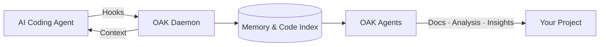

# Open Agent Kit

[](https://github.com/goondocks-co/open-agent-kit/actions/workflows/pr-check.yml)
[](https://github.com/goondocks-co/open-agent-kit/actions/workflows/release.yml)

[](https://pypi.org/project/oak-ci/)
[](https://www.python.org/)
[](LICENSE)

**Your Team's Memory in the Age of AI-Written Code**

You architect. AI agents build. But the reasoning, trade-offs, and lessons learned disappear between sessions. OAK records the full development story — plans, decisions, gotchas, and context — creating a history that's semantically richer than git could ever be. Then autonomous OAK Agents and Skills turn that captured intelligence into better documentation, deeper insights, and ultimately higher quality software, faster.




## Quick Start

```bash
# Install via Homebrew (macOS)
brew install goondocks-co/oak/oak-ci
```

```bash
# Or via the install script (macOS / Linux)
curl -fsSL https://raw.githubusercontent.com/goondocks-co/open-agent-kit/main/install.sh | sh
```

```bash
# Initialize your project
oak init
```

> **Windows?** See [QUICKSTART.md](QUICKSTART.md) for PowerShell install and other methods (pipx, uv, pip).

<details>
<summary><strong>Beta / pre-release channel</strong></summary>

```bash
# Homebrew (macOS) — installs the binary as `oak-beta`
brew install goondocks-co/oak/oak-ci-beta

# Install script (macOS / Linux) — set OAK_CHANNEL=beta
OAK_CHANNEL=beta curl -fsSL https://raw.githubusercontent.com/goondocks-co/open-agent-kit/main/install.sh | sh

# Install script (Windows PowerShell)
$env:OAK_CHANNEL = "beta"; irm https://raw.githubusercontent.com/goondocks-co/open-agent-kit/main/install.ps1 | iex

# pipx (manually)
pipx install oak-ci --python python3.13 --pip-args='--pre' --suffix=-beta

# uv (manually)
uv tool install oak-ci --python python3.13 --prerelease=allow
```

The beta formula installs the binary as `oak-beta`, so stable and beta can coexist.
After installing, run `oak-beta init` in your project — this automatically sets
`cli_command: oak-beta` in `.oak/config.yaml` so hooks and skills use the right binary.

</details>

Open the OAK Dashboard in your browser:

```bash
oak ci start --open
```

Start coding!

```bash
claude
```

> **[Full documentation](https://openagentkit.app/)** | **[Quick Start](QUICKSTART.md)** | **[Contributing](CONTRIBUTING.md)**

## Supported Agents

| Agent | Hooks | MCP | Skills |
|-------|-------|-----|--------|
| **Claude Code** | Yes | Yes | Yes |
| **Gemini CLI** | Yes | Yes | Yes |
| **Cursor** | Yes | Yes | Yes |
| **Codex CLI** | Yes (OTel) | Yes | Yes |
| **OpenCode** | Yes (Plugin) | Yes | Yes |
| **Windsurf** | Yes | No | Yes |
| **VS Code Copilot** | Yes | Yes | Yes |

## Contributing

See [CONTRIBUTING.md](CONTRIBUTING.md) for the contributor guide and [oak/constitution.md](oak/constitution.md) for coding standards.

## Security

See [SECURITY.md](SECURITY.md) for the vulnerability reporting policy.

## License

[MIT](LICENSE)
