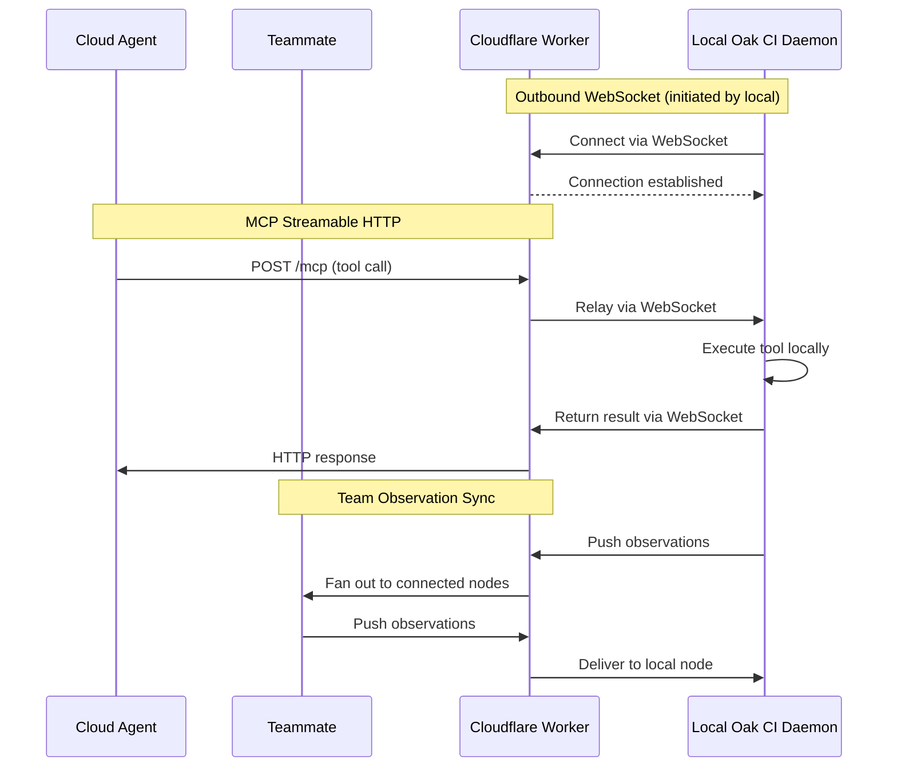

**Cloud Relay** is the Cloudflare Worker that serves as the transport layer for [Teams](/open-agent-kit/features/teams/). It powers two capabilities:

1. **[Team Sync](/open-agent-kit/features/teams/)** — Share observations between team members in real time via WebSocket relay
2. **[Cloud Agent Access](/open-agent-kit/features/cloud-relay/cloud-agents/)** — Let cloud-hosted AI agents (Claude.ai, ChatGPT, etc.) call your local MCP tools through a secure HTTP endpoint

Your codebase never leaves your machine — only MCP tool calls, their results, and observation payloads travel through the relay.

## How It Works

The key insight is that **your local daemon initiates the connection outward** — no inbound ports, no firewall rules, no dynamic DNS. The Cloudflare Worker relays messages between all connected sides.

### Architecture

| Component | Role | Runs On |
|-----------|------|---------|
| **Cloudflare Worker** | Accepts MCP requests and relays observations | Cloudflare's edge network (your account) |
| **Durable Object** | Manages WebSocket state, message routing, and observation buffering | Cloudflare (co-located with Worker) |
| **WebSocket Client** | Maintains persistent outbound connection to Worker | Your local machine (inside Oak CI daemon) |

### Turnkey Deployment

Cloud Relay uses a **turnkey deployment model** — a single command (or button click) handles the entire pipeline:

1. Scaffolds a Cloudflare Worker project in `oak/cloud-relay/`
2. Installs npm dependencies
3. Verifies Cloudflare authentication
4. Deploys the Worker via `wrangler`
5. Connects the local daemon over WebSocket

Subsequent runs skip already-completed phases. For example, if the Worker is already deployed, clicking "Start Relay" or "Deploy" simply reconnects the WebSocket.

## What Gets Exposed

Cloud Relay exposes all MCP tools registered with your local Oak CI daemon. This includes:

- **Code search** — Semantic and keyword search across your codebase
- **Memory** — Project observations, gotchas, decisions, and learnings
- **Context** — Task-relevant context aggregation
- **Activity history** — Session and activity browsing

The relay also supports **federated queries** — when team sync is active:

- **Federated search** — Search queries are fanned out to all connected nodes and results are merged. Agents use `include_network=true` on `oak_search`, `oak_context`, `oak_sessions`, `oak_memories`, or `oak_stats`.
- **Federated tool calls** — Any MCP tool call can be routed to a specific remote node via `node_id`, or broadcast to all nodes. This works for both local agents with local MCP and cloud agents connected via Streamable HTTP.

The relay does **not** expose the full Oak CI web dashboard or direct filesystem access. Cloud agents interact exclusively through the structured MCP tool protocol.

## Cost

Cloud Relay runs entirely within Cloudflare's free tier for typical developer usage:

| Resource | Free Tier Limit | Typical Usage |
|----------|----------------|---------------|
| Worker requests | 100,000/day | ~500-2,000/day |
| Worker CPU time | 10ms/request | ~2-5ms/request |
| Durable Object requests | 100,000/day | ~500-2,000/day |
| Durable Object storage | 1 GB | < 1 KB |
| WebSocket messages | Unlimited | ~1,000-5,000/day |
| Egress bandwidth | Free | All |

No credit card is required. The free tier comfortably handles a small team's workload with significant headroom.

## Prerequisites

Before setting up Cloud Relay, you need:

- **Oak CI** installed and running (`oak ci start`)
- **Cloudflare account** (free) — see [Cloudflare Setup](/open-agent-kit/features/cloud-relay/cloudflare-setup/)
- **Node.js** (v18+) for `npm` and the `wrangler` CLI
- For cloud agents: a cloud AI agent that supports MCP Streamable HTTP (Claude.ai, ChatGPT, etc.)

## Next Steps

- **[Cloudflare Setup](/open-agent-kit/features/cloud-relay/cloudflare-setup/)** — Create your free account and install wrangler
- **[Teams](/open-agent-kit/features/teams/)** — Set up team observation sync via the relay
- **[Cloud Agents](/open-agent-kit/features/cloud-relay/cloud-agents/)** — Register cloud AI agents with your relay
- **[Authentication](/open-agent-kit/features/cloud-relay/authentication/)** — Understand the two-token security model
- **[Deployment](/open-agent-kit/features/cloud-relay/deployment/)** — Worker lifecycle, re-deployment, and management
