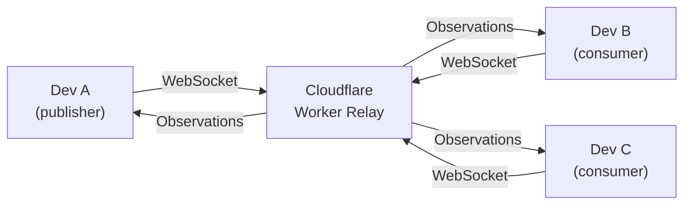

**Teams** is OAK's collaboration layer. It lets you share Codebase Intelligence across developers and machines using a **relay-based peer architecture** — all nodes push and receive observations through a shared [Cloud Relay](/open-agent-kit/features/cloud-relay/) (a Cloudflare Worker). There is no central server or peer-to-peer hub.

The same relay also powers [Cloud Agent Access](/open-agent-kit/features/cloud-relay/cloud-agents/) — letting cloud-hosted AI agents (Claude.ai, ChatGPT, etc.) call your local MCP tools through a secure HTTP endpoint.

## Architecture Overview



Every node is a peer. One developer **deploys** the relay Worker (the "publisher"), and teammates **join** by entering the relay URL and API key. Once connected, observations flow automatically in both directions.

### What Gets Synced

| Data | Synced | Notes |
|------|--------|-------|
| Memory observations | Yes | Gotchas, decisions, discoveries, bug fixes, trade-offs |
| Sessions | No | Sessions are local to each machine |
| Prompt batches | No | Prompt data stays local |
| Activities | No | Tool execution logs stay local |
| Code index | No | Each machine indexes its own codebase |

:::note[Observations only]
Team sync shares **observations only** — the distilled knowledge extracted from coding sessions. Raw session data, prompts, and tool logs remain on each developer's machine. This keeps the sync payload small and respects developer privacy.
:::

### Federated Search & Tool Calls

When team sync is active, MCP tool queries can be **federated** across all connected nodes through the relay:

- **Search fan-out** — Set `include_network=true` on `oak_search`, `oak_context`, `oak_sessions`, `oak_memories`, or `oak_stats` to fan the query out to all connected nodes. Each node executes against its local index and returns results, which are merged and ranked. This means your agents can find code patterns and memories from across the entire team — without any node needing a copy of another's full index.
- **Targeted tool calls** — Set `node_id` on `oak_resolve_memory`, `oak_activity`, or `oak_archive_memories` to route the call to a specific remote node. Use `oak_nodes` to discover available nodes and their capabilities.
- **Cloud agent access** — Cloud agents connected via [Streamable HTTP](/open-agent-kit/features/cloud-relay/cloud-agents/) have the same federation capabilities as local agents.

:::note[Code search stays local]
`include_network` is not available for `search_type="code"` — code is project-specific and searching another machine's index would return irrelevant file paths. Memory, session, plan, and stats queries federate well because they are project-agnostic knowledge.
:::

## Getting Started

### Option A: Deploy a Relay (Publisher)

If you're the first team member setting up sync:

1. Open the **Teams** page in the dashboard
2. Click **Deploy** — this runs the [Cloud Relay](/open-agent-kit/features/cloud-relay/) turnkey pipeline:
   - Scaffolds a Cloudflare Worker project in `oak/cloud-relay/`
   - Installs dependencies and verifies Cloudflare authentication
   - Deploys the Worker via `wrangler`
   - Connects the daemon over WebSocket
3. Share the **Relay URL** and **API Key** with your team

Or from the CLI:

```bash
oak ci cloud-init          # Deploy and connect
```

:::tip[Prerequisites]
You need a free Cloudflare account and Node.js v18+. See [Cloudflare Setup](/open-agent-kit/features/cloud-relay/cloudflare-setup/) for account creation and wrangler authentication.
:::

### Option B: Join a Team (Consumer)

If a teammate has already deployed a relay:

1. Open the **Teams** page in the dashboard
2. Enter the **Relay URL** and **API Key** your teammate shared
3. Click **Connect**

Or configure manually in `.oak/ci/config.yaml`:

```yaml
team:
  relay_worker_url: https://oak-relay-myproject.you.workers.dev
  api_key: <shared-api-key>
  auto_sync: true
  sync_interval_seconds: 3
```

Once connected, observations begin syncing immediately. On first connect, the relay drains any pending observations from other nodes so you receive the team's full history.

## Team Status

The Teams page shows real-time connection status:

- **Connection Status** — Green when connected to the relay, with Cloudflare account name
- **Online Nodes** — List of connected team members with machine IDs
- **Sync Stats** — Queue depth, last sync time, total events sent
- **Relay Buffer** — Pending observations waiting to be drained to your node

### CLI Status

```bash
oak ci team status          # Show connection and sync status
oak ci team members         # List online team members
```

## Sync Settings

Control observation sync behavior from the Teams page or via configuration:

| Setting | Default | Range | Description |
|---------|---------|-------|-------------|
| **Auto sync** | Off | — | Start sync automatically on daemon startup |
| **Sync interval** | 3s | 1–60s | How often the outbox flushes observations to the relay |

```yaml
# In .oak/ci/config.yaml
team:
  auto_sync: true
  sync_interval_seconds: 3
```

The outbox worker uses exponential backoff on failures (up to 300 seconds) and resets to the base interval on success.

## Data Collection Policy

Control what observations are synced via the **data collection policy** in Governance settings:

| Setting | Default | Description |
|---------|---------|-------------|
| `sync_observations` | `true` | Whether observations are written to the team outbox |

When `sync_observations` is set to `false`, observations are stored locally only and never sent to the relay. This is useful for sensitive projects or temporary opt-outs.

```yaml
# In .oak/ci/config.yaml
codebase_intelligence:
  governance:
    data_collection:
      sync_observations: true
```

You can also toggle this from the dashboard: **Teams > Policy**.

## Cloud Agent Access (MCP)

When the relay is deployed, cloud AI agents can also connect via MCP. The relay exposes all registered MCP tools through a Streamable HTTP endpoint:

- **MCP Endpoint**: `https://<your-worker>.workers.dev/mcp`
- **Agent Token**: Displayed on the Teams page (masked with reveal/copy)

See [Cloud Agents](/open-agent-kit/features/cloud-relay/cloud-agents/) for per-agent setup instructions (Claude.ai, ChatGPT, MCP config files).

## Leaving a Team

Click **Leave Team** on the Teams page, or disconnect via CLI:

```bash
oak ci cloud-disconnect
```

This disconnects the relay and clears team configuration. The Worker is **not** deleted — you can rejoin later by re-entering the URL and key.

## Team Backups

Each machine produces its own backup file named `{github_user}_{hash}.sql`, stored in `oak/history/` (git-tracked by default). This means every developer on the team has their own backup alongside the source code.

### What Gets Backed Up

| Data | Included | Notes |
|------|----------|-------|
| Sessions | Always | Full session metadata including parent/child links |
| Prompt batches | Always | User prompts, classifications, plan content |
| Memories | Always | All observations (gotchas, decisions, bug fixes, etc.) |
| Activities | Configurable | Raw tool execution logs — can be large. Controlled by backup settings or `--include-activities` flag |

### Backup Location

The default backup directory is `oak/history/` inside your project. This is designed to be committed to git so backups travel with the codebase.

To use an alternative location (e.g., a secure network share):
- Set the `OAK_CI_BACKUP_DIR` environment variable, or
- Add it to your project's `.env` file

### Deduplication

Backups use content-based hashing for cross-machine deduplication:

| Table | Hash Based On |
|-------|---------------|
| sessions | Primary key (session ID) |
| prompt_batches | session_id + prompt_number |
| memory_observations | observation + type + context |
| activities | session_id + timestamp + tool_name |

Multiple developers' backups can be merged without duplicates.

## Automatic Backups

The daemon can create backups automatically on a configurable schedule. This ensures your CI data is always preserved without manual intervention.

### Enabling Automatic Backups

Automatic backups are **disabled by default**. Enable them from the **Backup Settings** card on the Teams page, or via the configuration file:

```yaml
# In .oak/config.{machine_id}.yaml
codebase_intelligence:
  backup:
    auto_enabled: true
    interval_minutes: 30
```

### Settings

| Setting | Default | Description |
|---------|---------|-------------|
| **Automatic backups** | Off | Enable periodic automatic backups |
| **Include activities** | On | Include the activities table in backups (larger files) |
| **Backup before upgrade** | On | Automatically create a backup before `oak upgrade` runs |
| **Backup interval** | 30 min | How often automatic backups run (5 min to 24 hours) |

The backup interval field appears when automatic backups are enabled. Changes take effect on the next backup cycle.

### How It Works

- The daemon runs a background loop that checks the interval and creates backups automatically
- Each automatic backup replaces the previous one for your machine (one file per machine)
- The "Include activities" setting applies to both automatic and manual backups when no explicit flag is given
- The CLI `--include-activities` flag overrides the configured default

### Pre-Upgrade Backups

When **Backup before upgrade** is enabled (the default), running `oak upgrade` automatically creates a backup before applying any changes. This provides a safety net in case an upgrade modifies the database schema.

## Backup & Restore

### Creating Backups

```bash
oak ci backup                        # Standard backup (uses configured defaults)
oak ci backup --include-activities   # Include raw activities (overrides config)
oak ci backup --list                 # List available backups
```

Or use the **Create Backup** button on the Teams page in the dashboard.

### Restoring

Restore your own backup or any team member's backup:

```bash
oak ci restore                                        # Restore your own backup
oak ci restore --file oak/history/teammate_a7b3c2.sql   # Restore a teammate's backup
```

After restore, ChromaDB is automatically rebuilt in the background to re-embed all memories with the current embedding model.

### Schema Evolution

- **Older backup → newer schema**: Missing columns use SQLite defaults (usually NULL). Works automatically.
- **Newer backup → older schema**: Extra columns are stripped during import. A warning is logged but import proceeds. No data loss for columns that exist in both schemas.

## Team Sync (`oak ci sync`)

The recommended way for teams to stay in sync. This single command handles the full workflow:

```bash
oak ci sync              # Standard sync
oak ci sync --full       # Rebuild index from scratch
oak ci sync --team       # Merge all team backups
oak ci sync --dry-run    # Preview without applying changes
```

### What sync does

1. **Stop daemon** — Ensures clean state for data operations
2. **Restore backups** — Applies your personal backup
3. **Start daemon** — Brings the daemon back up
4. **Run migrations** — Applies any schema changes from upgrades
5. **Create fresh backup** — Saves current state

### Flags

| Flag | Description |
|------|-------------|
| `--full` | Rebuild the entire code index from scratch |
| `--team` | Also merge all team member backups from `oak/history/` |
| `--include-activities` | Include the activities table in backup (larger file) |
| `--dry-run` | Preview what would happen without applying changes |

:::tip
Run `oak ci sync --team` after pulling from git to pick up your teammates' latest backups.
:::

## Next Steps

- **[Cloud Relay](/open-agent-kit/features/cloud-relay/)** — How the Cloudflare Worker relay works under the hood
- **[Cloudflare Setup](/open-agent-kit/features/cloud-relay/cloudflare-setup/)** — Create your free account and install wrangler
- **[Cloud Agents](/open-agent-kit/features/cloud-relay/cloud-agents/)** — Register cloud AI agents with your relay
- **[Authentication](/open-agent-kit/features/cloud-relay/authentication/)** — Understand the two-token security model

## Known Issues & Gotchas

:::caution[Share the API key out-of-band]
The relay authentication token is only stored in the Worker's secrets and your local config. New nodes attempting to connect need the API key shared by the publisher — always share it securely with teammates when they join.
:::
