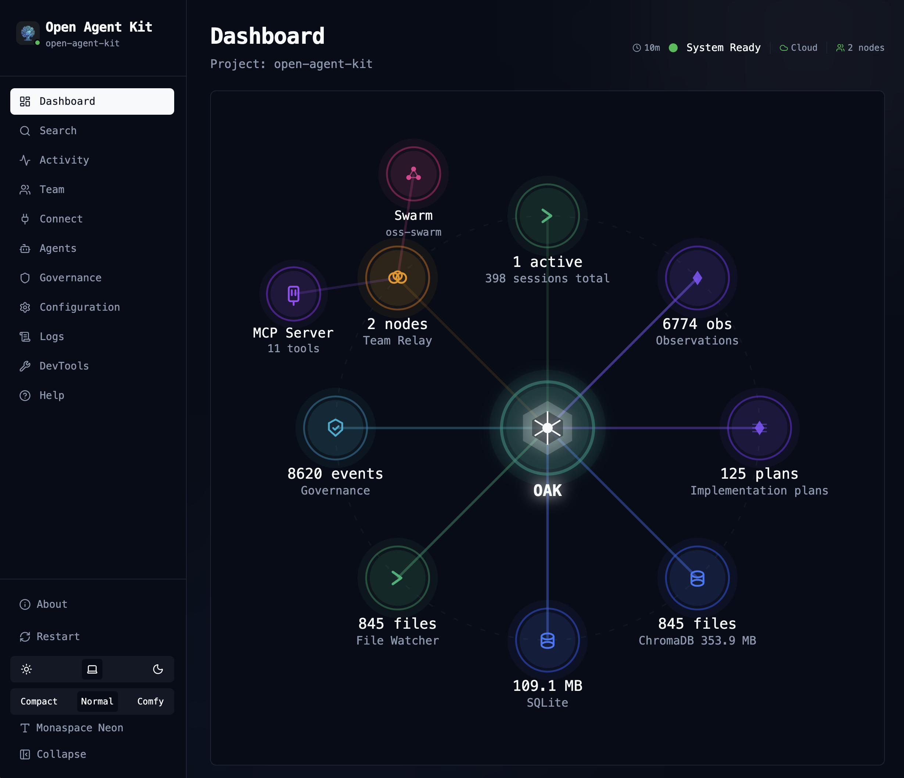

import { Steps, Card, CardGrid } from "@astrojs/starlight/components";

## Why OAK?

When AI agents build your software, every session produces plans, architectural decisions, trade-offs, and hard-won lessons. But all of that context vanishes when the session ends — leaving you with code changes and a git diff that can never tell the full story.

OAK captures what git can't.

<CardGrid>
  <Card title="The Complete Development Record" icon="pencil">
    Every plan, decision, gotcha, and trade-off is recorded automatically as your agents work — creating a development history that's semantically richer than git blame could ever be.
  </Card>
  <Card title="Semantic Code Search" icon="magnifier">
    Agents find code by *concept* ("where is auth?") rather than just regex, using AST-aware indexing across 13 languages and vector embeddings.
  </Card>
  <Card title="Context That Follows You" icon="rocket">
    Relevant memories and code context are automatically injected into every agent session — preventing regressive bugs and circular conversations across your entire team.
  </Card>
  <Card title="Autonomous Agents" icon="laptop">
    OAK Agents turn captured intelligence into action — generating documentation, surfacing insights, and improving your codebase using everything OAK has learned.
  </Card>
</CardGrid>

## Quick Start

<Steps>

1. **Install OAK**

   ```bash
   # Homebrew (macOS — recommended, handles Python version automatically)
   brew install goondocks-co/oak/oak-ci

   # Or via the install script (macOS / Linux)
   curl -fsSL https://raw.githubusercontent.com/goondocks-co/main/install.sh | sh

   # Or via pipx (requires Python 3.12 or 3.13)
   pipx install oak-ci --python python3.13

   # Or via uv (requires Python 3.12 or 3.13)
   uv tool install oak-ci --python python3.13
   ```

2. **Initialize your project**

   ```bash
   cd your-project
   oak init              # Interactive mode — pick your agent(s) and languages
   ```

3. **Start the daemon and open the dashboard**

   ```bash
   oak team start --open
   ```

   The dashboard opens in your browser. From here, you can configure embedding models, browse sessions, search your codebase, and manage memories — all from the UI.

</Steps>

That's it! OAK is now running. **The dashboard is your primary interface** — use it to configure settings, explore agent activity, search code, and manage project memory. The CLI is only needed for [setup and maintenance tasks](/cli/).


