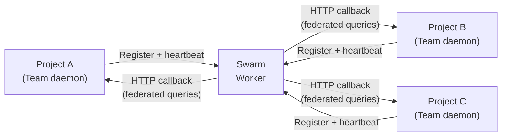

**Swarm** enables cross-project federation by connecting multiple OAK projects into a unified network. Where [Team Sync](/team/sync/) shares observations between developers and machines on the *same* project, Swarm connects *different* projects — enabling agents to search code, query memories, and discover patterns across your entire portfolio.

:::caution[Early Feature]
Swarm is a new feature under active development. The CLI, API surface, and UI may change between releases.
:::

:::note[Team vs Swarm]
**Team** = multiple developers/machines on the *same* project. Federation uses `include_network=true` on standard MCP tools to fan out across team nodes. **Swarm** = multiple *projects* connected together. Uses dedicated `swarm_*` tools to fan out across projects. Both can be active simultaneously.
:::

## How It Works

Swarm uses a Cloudflare Worker (similar to the [Team relay](/team/sync/)) as the central registry and query router. Each project registers with the swarm Worker and advertises its capabilities. When a swarm query arrives, the Worker fans it out to all registered projects via HTTP callbacks to each project's Team daemon.



Each project retains its own local data — code index, sessions, memories. Swarm enables **federated queries** that fan out to all connected projects and merge results. No data is copied to the swarm Worker; it only routes queries and aggregates responses.

## Capabilities

- **Cross-project search** — Search for code patterns and memories across all connected projects via `swarm_search`
- **Full content retrieval** — Fetch complete code snippets from search results via `swarm_fetch`
- **Node discovery** — List connected projects and their status via `swarm_nodes`
- **MCP integration** — Swarm tools are available to any MCP-compatible agent alongside the standard Team tools

## Getting Started

### 1. Create a swarm configuration

```bash
oak swarm create
```

This scaffolds the swarm Worker project and generates authentication tokens.

### 2. Deploy the swarm Worker

```bash
oak swarm deploy
```

Deploys the Worker to your Cloudflare account. Requires the same prerequisites as [Team Sync](/team/sync/#prerequisites) (free Cloudflare account + Node.js v18+).

### 3. Start the swarm daemon

```bash
oak swarm start
```

The swarm daemon connects to the deployed Worker and makes this project available for cross-project queries.

### 4. Connect other projects

In each additional project that should join the swarm, configure the swarm URL and token, then start the swarm daemon.

## CLI Commands

```bash
oak swarm create     # Create a new swarm configuration
oak swarm deploy     # Deploy the swarm Worker to Cloudflare
oak swarm destroy    # Remove the swarm Worker
oak swarm start      # Start the swarm daemon
oak swarm stop       # Stop the swarm daemon
oak swarm restart    # Restart the swarm daemon
oak swarm status     # Show swarm status and connected nodes
oak swarm mcp        # Start the swarm MCP server
```

## Swarm MCP Tools

When connected to a swarm, additional MCP tools become available to agents:

| Tool | Description |
|------|-------------|
| `swarm_search` | Search across all swarm-connected projects |
| `swarm_fetch` | Fetch full details for items found via `swarm_search` |
| `swarm_nodes` | List connected projects and their status |
| `swarm_status` | Show swarm connection status |

These tools appear alongside the standard Team tools in any MCP-compatible agent. See the [MCP Tools Reference](/swarm/mcp/#swarm_search) for full parameter documentation.

## Swarm Agents

Swarm ships with built-in agents that can run tasks spanning multiple projects:

| Task | Description |
|------|-------------|
| **Cross-Project Report** | Analyze patterns and insights across all connected projects |
| **Dependency Audit** | Discover shared dependencies and version discrepancies |
| **Pattern Finder** | Find recurring implementation patterns across projects |

Run these from the swarm daemon's web UI, which provides a dashboard with connected nodes, federated search, and agent management.

:::note[Work in progress]
Swarm agents are present in the UI but are not fully functional yet. Cross-project search and node discovery work reliably; agent task execution is still maturing.
:::

## Architecture

| Component | Role |
|-----------|------|
| **Swarm Worker** | Cloudflare Worker + Durable Object that manages the team registry and routes federated queries |
| **Swarm Daemon** | Per-project FastAPI process that registers with the Worker and handles incoming federated callbacks |
| **Swarm UI** | Web dashboard for managing nodes and searching across projects |
| **Swarm MCP Server** | Exposes swarm tools to MCP-compatible agents (runs via `oak team mcp` or `oak swarm mcp`) |

## Next Steps

- **[Team Sync](/team/sync/)** — Share observations within a single project
- **[CLI Reference](/cli/#swarm)** — Full swarm command reference
