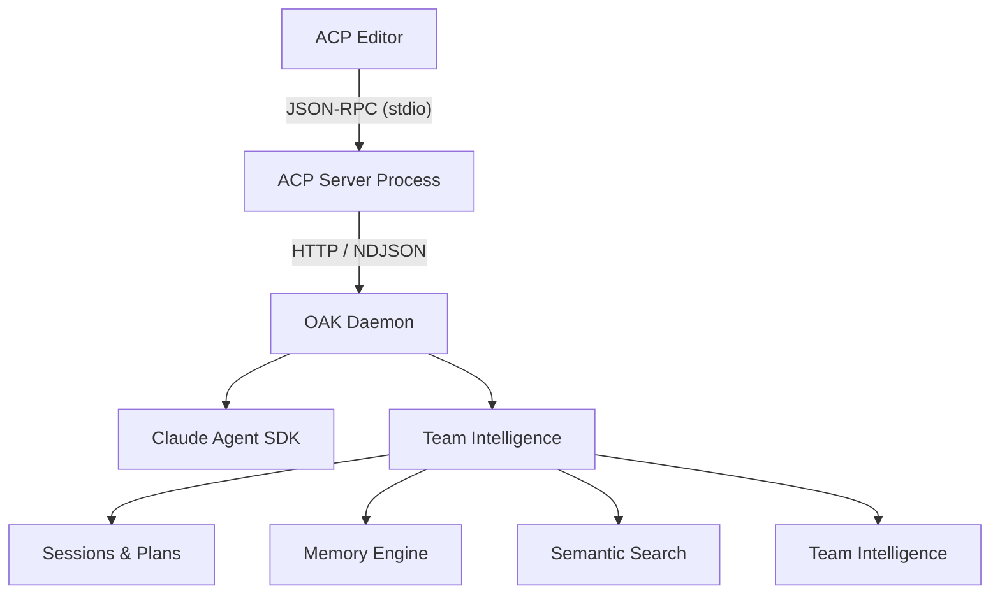

The **[Agent Client Protocol (ACP)](https://agentclientprotocol.com/)** integration turns OAK into a full coding agent that any ACP-compatible editor can talk to directly. Instead of only enriching other agents through hooks and MCP tools, OAK becomes the agent — with all of team intelligence built in.

## What is ACP?

ACP is a standardized protocol that lets editors communicate with AI coding agents over a lightweight JSON-RPC transport. [ACP-compatible editors](https://agentclientprotocol.com/get-started/clients) like [Zed](https://zed.dev) use ACP to connect to agents that can read files, edit code, run commands, and respond conversationally — all within the editor's UI.

With ACP support, OAK exposes itself as an agent named **"OAK Agent"** that editors discover and connect to automatically.

## Why Use OAK via ACP?

When you use OAK through ACP instead of a standalone agent with hooks:

- **CI is built in** — No hook latency. Semantic search, memory injection, and context are part of every response.
- **Session recording is automatic** — Every prompt, tool call, and response is recorded in the activity store.
- **Focus switching** — Switch the agent's specialization mid-session (documentation, analysis, engineering, maintenance) without starting a new conversation.
- **Permission modes** — Control what the agent can do: full access (Code), plan-then-execute (Architect), or ask-per-action (Ask).

:::caution[Daemon required]
The ACP server is a thin protocol bridge — all intelligence lives in the OAK daemon. The daemon must be running (`oak team start`) before launching the ACP server.
:::

## Quick Start

### 1. Start the OAK daemon

```bash
oak team start
```

### 2. Configure your editor

**Zed** — Add to your Zed settings (`settings.json`):

```json
{
  "agent_servers": {
    "OAK Agent": {
      "type": "custom",
      "command": "oak",
      "args": ["acp", "serve"],
      "env": {}
    }
  }
}
```

Then select **OAK Agent** from the agent picker in Zed's AI panel.

### 3. Start coding

The OAK Agent appears in your editor with full access to semantic code search, project memory, and all CI tools.

## Architecture

The ACP integration uses a three-layer architecture:



**Editor ↔ ACP Server** — JSON-RPC over stdio. The editor launches `oak acp serve` as a subprocess and communicates via stdin/stdout.

**ACP Server ↔ Daemon** — HTTP requests to the daemon's REST API. The ACP process discovers the daemon port from `.oak/ci/daemon.port` and authenticates with a local bearer token.

**Daemon** — All the real work happens here: session management, Claude SDK execution, activity recording, context injection, and memory extraction. The ACP server is deliberately thin — it only translates between the ACP protocol and the daemon's HTTP API.

## Session Modes

The editor exposes three permission modes that control how the agent interacts with your codebase:

| Mode | Behavior | Use When |
|------|----------|----------|
| **Code** | Full tool access. The agent reads, writes, and executes freely. | You trust the agent to make changes directly. |
| **Architect** | The agent proposes a plan first. You review and approve before any changes are made. | You want to see the approach before execution. |
| **Ask** | The agent asks permission for each action individually. | You want maximum control over every operation. |

Switch modes at any time from the editor's session controls — the change takes effect on the next prompt.

## Agent Focus

Focus switching lets you specialize the agent for different types of work without starting a new session. Conversation history is preserved when you switch focus.

| Focus | Purpose | Tools Available | CI Access |
|-------|---------|-----------------|-----------|
| **Oak** (default) | Interactive coding with full CI context | Read, Write, Edit, Glob, Grep, Bash | Full: search, memory, sessions, stats, SQL |
| **Documentation** | Project documentation maintenance | Read, Write, Edit, Glob, Grep | Search, memory, sessions (no Bash) |
| **Analysis** | CI data analysis and project insights | Read, Write, Edit, Glob, Grep | SQL queries, memory, stats (no code search) |
| **Engineering** | Team role-based engineering tasks | Read, Write, Edit, Glob, Grep, Bash | Full access including external MCP servers |
| **Maintenance** | Memory store health management | Read, Glob, Grep | Memory write access for consolidation |

:::note[Focus must be set at session start or via config]
The agent template is resolved when a focus is set. If your editor exposes a "focus" dropdown, changing it mid-session swaps the system prompt and CI access profile while preserving conversation history.
:::

## Daemon API Endpoints

The ACP integration adds these endpoints to the daemon's REST API:

### Interactive Sessions

| Method | Path | Description |
|--------|------|-------------|
| `POST` | `/api/acp/sessions` | Create a new interactive session |
| `POST` | `/api/acp/sessions/{id}/prompt` | Send a prompt (streams NDJSON events) |
| `POST` | `/api/acp/sessions/{id}/cancel` | Cancel an in-progress prompt |
| `PUT` | `/api/acp/sessions/{id}/mode` | Set permission mode |
| `PUT` | `/api/acp/sessions/{id}/focus` | Set agent focus |
| `POST` | `/api/acp/sessions/{id}/approve-plan` | Approve a proposed plan (Architect mode) |
| `DELETE` | `/api/acp/sessions/{id}` | Close and clean up a session |

### Server Management

| Method | Path | Description |
|--------|------|-------------|
| `GET` | `/api/acp/status` | Check if the ACP server is running |
| `POST` | `/api/acp/start` | Start the ACP server subprocess |
| `POST` | `/api/acp/stop` | Stop the ACP server subprocess |
| `GET` | `/api/acp/logs` | Get recent ACP server logs |

## Execution Events

When you send a prompt, the daemon streams execution events as NDJSON (newline-delimited JSON). The ACP server translates these into editor updates:

| Event | Description |
|-------|-------------|
| `text` | Agent response text (streamed incrementally) |
| `thought` | Internal reasoning (when extended thinking is enabled) |
| `tool_start` | Tool invocation started — includes tool name and inputs |
| `tool_progress` | Tool execution progress update |
| `tool_result` | Tool completed — includes output |
| `plan_update` | Task breakdown for visibility |
| `plan_proposed` | Plan awaiting user approval (Architect mode) |
| `cost` | Token usage tracking |
| `done` | Stream end — signals if plan approval is needed |
| `error` | Execution error |
| `cancelled` | Execution was cancelled |

Tools are classified into ACP kinds for the editor UI:

- **Read**: `Read`, `Glob`, `Grep`, `LS`, `NotebookRead`
- **Edit**: `Edit`, `MultiEdit`, `Write`, `NotebookEdit`
- **Command**: `Bash`, `Task` (and any unrecognized tools)

## Activity Recording

ACP sessions are fully integrated with the OAK activity store:

- **Prompt batches** — Each user prompt creates a batch with source type `acp`
- **Tool activity** — Every tool call is recorded via Claude SDK hooks
- **Observations** — Background LLM extracts gotchas, decisions, and discoveries from your session
- **Session summaries** — Generated asynchronously when you close the session
- **Plans** — Captured automatically when the agent proposes changes in Architect mode

ACP sessions appear alongside hook-captured sessions in the [Activities](/team/activities/) page and are searchable through semantic search and the `/oak` skill.

## Troubleshooting

### Daemon not running

```
OAK daemon is not running. Start it with 'oak team start'.
```

The ACP server requires the daemon. Start it first:

```bash
oak team start
```

### Check ACP logs

Logs are written to `.oak/ci/acp.log` (stdout is reserved for JSON-RPC):

```bash
tail -f .oak/ci/acp.log
```

### Session not appearing in dashboard

ACP sessions are recorded with agent type `oak`. Use the **Oak** filter on the [Activities](/team/activities/) page to find them.

### Editor can't connect

Verify the ACP server works standalone:

```bash
oak acp serve
```

If it exits immediately, check the daemon status with `oak team status`.
