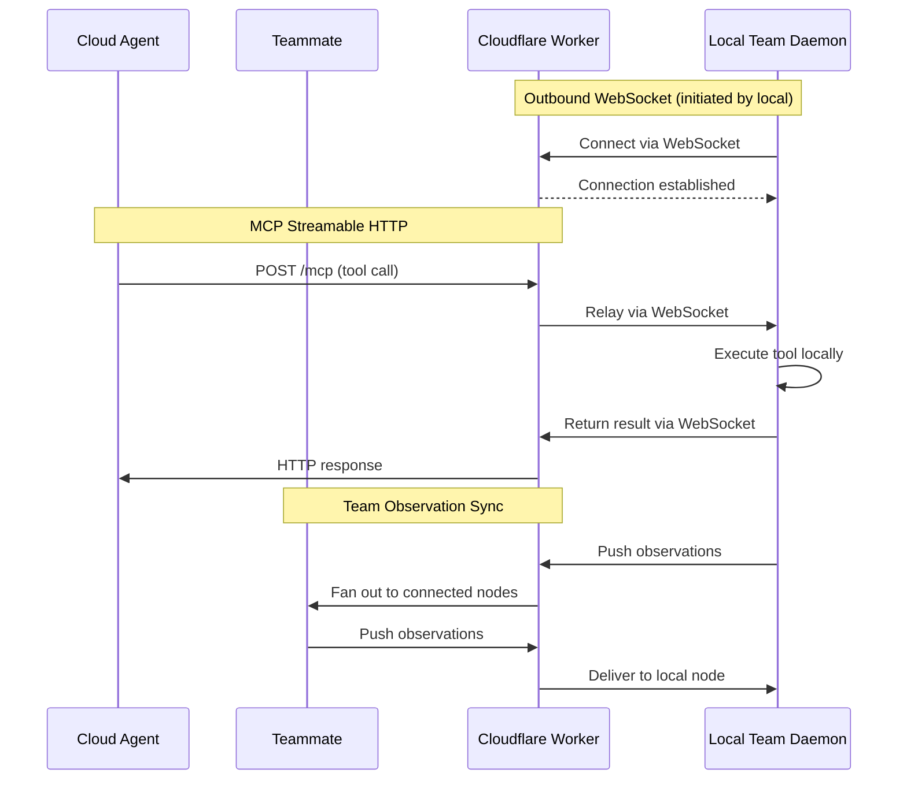

**Team Sync** connects developers, machines, and cloud AI agents into a single collaborative network. When you connect to a team, you get:

- **Observation sharing** — Memories, decisions, gotchas, and discoveries sync across all connected nodes
- **Federated search & tool calls** — Query any node's local index from any other node
- **Cloud agent access** — Cloud-hosted AI agents (Claude.ai, ChatGPT, etc.) call your local MCP tools through a secure HTTP endpoint

All of this runs through a **Cloudflare Worker relay** that OAK deploys and manages for you. Your codebase never leaves your machine — only MCP tool calls, their results, and observation payloads travel through the relay.

## Architecture



Your local daemon initiates the connection outward — no inbound ports, no firewall rules, no dynamic DNS. The Cloudflare Worker relays messages between all connected sides.

| Component | Role | Runs On |
|-----------|------|---------|
| **Cloudflare Worker** | Accepts MCP requests and relays observations | Cloudflare's edge network (your account) |
| **Durable Object** | Manages WebSocket state, message routing, and observation buffering | Cloudflare (co-located with Worker) |
| **WebSocket Client** | Maintains persistent outbound connection to Worker | Your local machine (inside OAK daemon) |

### What Gets Synced

| Data | Synced | Notes |
|------|--------|-------|
| Memory observations | Yes | Gotchas, decisions, discoveries, bug fixes, trade-offs |
| Sessions | No | Sessions are local to each machine |
| Prompt batches | No | Prompt data stays local |
| Activities | No | Tool execution logs stay local |
| Code index | No | Each machine indexes its own codebase |

:::note[Observations only]
Team sync shares **observations only** — the distilled knowledge extracted from coding sessions. Raw session data, prompts, and tool logs remain on each developer's machine. This keeps the sync payload small and respects developer privacy.
:::

### Federated Search & Tool Calls

When connected to a team, MCP tool queries can be **federated** across all connected nodes:

- **Search fan-out** — Set `include_network=true` on `oak_search`, `oak_context`, `oak_sessions`, `oak_memories`, or `oak_stats` to fan the query out to all connected nodes. Each node executes against its local index and returns results, which are merged and ranked. This means your agents can find code patterns and memories from across the entire team — without any node needing a copy of another's full index.
- **Targeted tool calls** — Set `node_id` on `oak_resolve_memory`, `oak_activity`, or `oak_archive_memories` to route the call to a specific remote node. Use `oak_nodes` to discover available nodes and their capabilities.
- **Cloud agent access** — Cloud agents connected via [MCP Streamable HTTP](/team/mcp/) have the same federation capabilities as local agents.

:::note[Code search stays local]
`include_network` is not available for `search_type="code"` — code is project-specific and searching another machine's index would return irrelevant file paths. Memory, session, plan, and stats queries federate well because they are project-agnostic knowledge.
:::

## Prerequisites

Team sync requires a free Cloudflare account and Node.js v18+.

### Cloudflare Account

1. Go to [cloudflare.com/sign-up](https://dash.cloudflare.com/sign-up)
2. Enter your email and create a password
3. Verify your email address

No credit card is required. The Workers free tier includes everything the relay needs.

### Wrangler CLI

Wrangler is Cloudflare's CLI for managing Workers:

```bash
# Option 1: Use via npx (recommended — no global install needed)
npx wrangler --version

# Option 2: Global install
npm install -g wrangler
wrangler --version
```

### Authenticate Wrangler

```bash
npx wrangler login
```

This opens your browser for an OAuth flow. Verify authentication:

```bash
npx wrangler whoami
```

:::tip
The OAK dashboard's **Teams** page includes a **Prerequisites** card that shows live checks for npm, wrangler, and authentication status.
:::

### Free Tier Limits

| Resource | Free Limit | Typical Usage |
|----------|------------|---------------|
| Worker requests | 100,000/day | ~500–2,000/day |
| Worker CPU time | 10ms/request | ~2–5ms/request |
| Durable Object requests | 100,000/day | ~500–2,000/day |
| Durable Object storage | 1 GB | < 1 KB |
| WebSocket messages | Unlimited | ~1,000–5,000/day |
| Egress bandwidth | Free | All |

For a typical developer workflow, free tier usage stays well under 5% of the daily limits.

## Getting Started

### Option A: Deploy (Publisher)

If you're the first team member setting up sync:

1. Open the **Teams** page in the dashboard
2. Click **Deploy** — this runs the turnkey deployment pipeline:
   - Scaffolds a Cloudflare Worker project in `oak/cloud-relay/`
   - Installs dependencies and verifies Cloudflare authentication
   - Deploys the Worker via `wrangler`
   - Connects the daemon over WebSocket
3. Share the **Relay URL** and **API Key** with your team

Or from the CLI:

```bash
oak team cloud-init          # Deploy and connect
```

The pipeline skips any phase that's already complete. First run takes ~30–60 seconds; reconnecting takes ~2–3 seconds.

### Option B: Join (Consumer)

If a teammate has already deployed a relay:

1. Open the **Teams** page in the dashboard
2. Enter the **Relay URL** and **API Key** your teammate shared
3. Click **Connect**

Or configure manually in `.oak/ci/config.yaml`:

```yaml
team:
  relay_worker_url: https://oak-relay-myproject.you.workers.dev
  api_key: <shared-api-key>
  auto_sync: true
  sync_interval_seconds: 3
```

Once connected, observations begin syncing immediately. On first connect, the relay drains any pending observations from other nodes so you receive the team's full history.

## Team Status

The Teams page shows real-time connection status:

- **Connection Status** — Green when connected to the relay, with Cloudflare account name
- **Online Nodes** — List of connected team members with machine IDs
- **Sync Stats** — Queue depth, last sync time, total events sent
- **Relay Buffer** — Pending observations waiting to be drained to your node

### CLI Status

```bash
oak team status          # Show connection and sync status
oak team members         # List online team members
```

## Sync Settings

Control observation sync behavior from the Teams page or via configuration:

| Setting | Default | Range | Description |
|---------|---------|-------|-------------|
| **Auto sync** | Off | — | Start sync automatically on daemon startup |
| **Sync interval** | 3s | 1–60s | How often the outbox flushes observations to the relay |

```yaml
# In .oak/ci/config.yaml
team:
  auto_sync: true
  sync_interval_seconds: 3
```

The outbox worker uses exponential backoff on failures (up to 300 seconds) and resets to the base interval on success.

## Data Collection Policy

Control what data is shared via the **data collection policy** in Governance settings:

| Setting | Default | Description |
|---------|---------|-------------|
| `sync_observations` | `true` | Whether observations are written to the team outbox |
| `federated_tools` | `true` | Whether this node's MCP tools are advertised to the relay for remote calls |

When `sync_observations` is set to `false`, observations are stored locally only and never sent to the relay. This is useful for sensitive projects or temporary opt-outs.

When `federated_tools` is set to `false`, other team nodes and cloud agents cannot call this node's MCP tools remotely — even if the relay is connected. Local tool access is unaffected.

:::caution[Federated tools default to enabled]
The `federated_tools` setting defaults to `true`. If you want a conservative opt-in rollout, set it to `false` in your configuration and enable it explicitly after reviewing what gets exposed.
:::

```yaml
# In .oak/ci/config.yaml
team:
  governance:
    data_collection:
      sync_observations: true
      federated_tools: true
```

You can also toggle both settings from the dashboard: **Teams > Policy**.

## Cloud Agent Access

When connected to a team, cloud AI agents can connect to the relay's MCP endpoint:

- **MCP Endpoint**: `https://<your-worker>.workers.dev/mcp`
- **Agent Token**: Displayed on the Teams page (masked with reveal/copy)

See [MCP Configuration](/team/mcp/) for per-agent setup instructions (Claude.ai, ChatGPT, mcp.json config files) and agent token details.

## Leaving a Team

Click **Leave Team** on the Teams page, or disconnect via CLI:

```bash
oak team cloud-disconnect
```

This disconnects the relay and clears team configuration. The Worker is **not** deleted — you can rejoin later by re-entering the URL and key.

## Deployment Details

### Generated Directory Structure

The deployment pipeline creates a Cloudflare Worker project at `oak/cloud-relay/`:

```
oak/cloud-relay/
  src/
    index.ts           # Worker entry point — HTTP routing and CORS
    auth.ts            # Token validation logic
    mcp-handler.ts     # MCP Streamable HTTP request handling
    relay-object.ts    # Durable Object — WebSocket relay and state
    types.ts           # Shared TypeScript interfaces
  wrangler.toml        # Cloudflare config with tokens and bindings
  package.json         # Dependencies (minimal)
  tsconfig.json        # TypeScript config
  .gitignore           # Excludes wrangler.toml, node_modules/, .wrangler/
```

The scaffold's `.gitignore` excludes `wrangler.toml` (contains secrets), `node_modules/`, and `.wrangler/`. Worker source code can be committed to version control.

### Worker Naming

Each project gets a unique Worker name derived from the project directory:

```
oak-relay-<sanitized-project-name>
```

For example, a project in `~/projects/my-app` gets the Worker name `oak-relay-my-app`.

### Re-Deploying After Upgrades

When you upgrade OAK, the Worker template may include protocol changes. To update:

```bash
oak team cloud-init --force
```

This re-scaffolds with the latest template, re-installs dependencies, and re-deploys. Existing tokens are preserved.

### Viewing Worker Logs

```bash
cd oak/cloud-relay
npx wrangler tail
```

### Removing a Deployment

```bash
cd oak/cloud-relay
npx wrangler delete        # Remove from Cloudflare
```

To clean up the local scaffold: `rm -rf oak/cloud-relay`

## Authentication

The relay uses a **two-token model** to secure both sides:

| Token | Purpose | Used By |
|-------|---------|---------|
| `relay_token` | Authenticates the daemon to the Worker | Local OAK daemon (WebSocket `Sec-WebSocket-Protocol` header) |
| `agent_token` | Authenticates cloud AI agents to the Worker | Claude.ai, ChatGPT, etc. (HTTP `Authorization: Bearer` header) |

Both tokens are generated automatically during deployment using `secrets.token_urlsafe(32)` (256 bits of entropy each).

### Token Storage

| Location | Contains |
|----------|----------|
| `.oak/config.yaml` | Both tokens |
| `oak/cloud-relay/wrangler.toml` | Both tokens as env vars (excluded from git) |
| Cloudflare Workers secrets | Both tokens (encrypted at rest) |

### Token Rotation

To rotate tokens (e.g., if compromised or to revoke all cloud agent access):

```bash
rm -rf oak/cloud-relay
oak team cloud-init
```

This generates fresh tokens and re-deploys. Update any cloud agents with the new agent token.

### Security Properties

- **No inbound ports** — The daemon initiates WebSocket outward. No incoming connections needed.
- **Transport encryption** — All connections use TLS (HTTPS for MCP, WSS for WebSocket).
- **Blast radius** — Each project has its own Worker with its own token pair.
- **CORS support** — The Worker includes CORS headers for browser-based MCP clients.

## Team Backups

Each machine produces its own backup file named `{github_user}_{hash}.sql`, stored in `oak/history/` (git-tracked by default). This means every developer on the team has their own backup alongside the source code.

### What Gets Backed Up

| Data | Included | Notes |
|------|----------|-------|
| Sessions | Always | Full session metadata including parent/child links |
| Prompt batches | Always | User prompts, classifications, plan content |
| Memories | Always | All observations (gotchas, decisions, bug fixes, etc.) |
| Activities | Configurable | Raw tool execution logs — can be large. Controlled by backup settings or `--include-activities` flag |

### Backup Location

The default backup directory is `oak/history/` inside your project. This is designed to be committed to git so backups travel with the codebase.

To use an alternative location (e.g., a secure network share):
- Set the `OAK_CI_BACKUP_DIR` environment variable, or
- Add it to your project's `.env` file

### Deduplication

Backups use content-based hashing for cross-machine deduplication:

| Table | Hash Based On |
|-------|---------------|
| sessions | Primary key (session ID) |
| prompt_batches | session_id + prompt_number |
| memory_observations | observation + type + context |
| activities | session_id + timestamp + tool_name |

Multiple developers' backups can be merged without duplicates.

## Automatic Backups

The daemon can create backups automatically on a configurable schedule. This ensures your CI data is always preserved without manual intervention.

### Enabling Automatic Backups

Automatic backups are **disabled by default**. Enable them from the **Backup Settings** card on the Teams page, or via the configuration file:

```yaml
# In .oak/config.{machine_id}.yaml
team:
  backup:
    auto_enabled: true
    interval_minutes: 30
```

### Settings

| Setting | Default | Description |
|---------|---------|-------------|
| **Automatic backups** | Off | Enable periodic automatic backups |
| **Include activities** | On | Include the activities table in backups (larger files) |
| **Backup before upgrade** | On | Automatically create a backup before `oak upgrade` runs |
| **Backup interval** | 30 min | How often automatic backups run (5 min to 24 hours) |

The backup interval field appears when automatic backups are enabled. Changes take effect on the next backup cycle.

### How It Works

- The daemon runs a background loop that checks the interval and creates backups automatically
- Each automatic backup replaces the previous one for your machine (one file per machine)
- The "Include activities" setting applies to both automatic and manual backups when no explicit flag is given
- The CLI `--include-activities` flag overrides the configured default

### Pre-Upgrade Backups

When **Backup before upgrade** is enabled (the default), running `oak upgrade` automatically creates a backup before applying any changes. This provides a safety net in case an upgrade modifies the database schema.

## Backup & Restore

### Creating Backups

```bash
oak ci backup                        # Standard backup (uses configured defaults)
oak ci backup --include-activities   # Include raw activities (overrides config)
oak ci backup --list                 # List available backups
```

Or use the **Create Backup** button on the Teams page in the dashboard.

### Restoring

Restore your own backup or any team member's backup:

```bash
oak ci restore                                        # Restore your own backup
oak ci restore --file oak/history/teammate_a7b3c2.sql   # Restore a teammate's backup
```

After restore, ChromaDB is automatically rebuilt in the background to re-embed all memories with the current embedding model.

### Schema Evolution

- **Older backup → newer schema**: Missing columns use SQLite defaults (usually NULL). Works automatically.
- **Newer backup → older schema**: Extra columns are stripped during import. A warning is logged but import proceeds. No data loss for columns that exist in both schemas.

## Team Sync (`oak ci sync`)

The recommended way for teams to stay in sync. This single command handles the full workflow:

```bash
oak ci sync              # Standard sync
oak ci sync --full       # Rebuild index from scratch
oak ci sync --team       # Merge all team backups
oak ci sync --dry-run    # Preview without applying changes
```

### What sync does

1. **Stop daemon** — Ensures clean state for data operations
2. **Restore backups** — Applies your personal backup
3. **Start daemon** — Brings the daemon back up
4. **Run migrations** — Applies any schema changes from upgrades
5. **Create fresh backup** — Saves current state

### Flags

| Flag | Description |
|------|-------------|
| `--full` | Rebuild the entire code index from scratch |
| `--team` | Also merge all team member backups from `oak/history/` |
| `--include-activities` | Include the activities table in backup (larger file) |
| `--dry-run` | Preview what would happen without applying changes |

:::tip
Run `oak ci sync --team` after pulling from git to pick up your teammates' latest backups.
:::

## Troubleshooting

### Wrangler Issues

**"wrangler: command not found"** — Install Node.js (which includes npm), then use `npx wrangler --version` or install globally with `npm install -g wrangler`.

**"wrangler login" opens browser but auth fails** — Check that popups aren't blocked. Try an incognito window. Behind a corporate proxy, use an API token instead:
```bash
export CLOUDFLARE_API_TOKEN=your-api-token
```
Generate a token in the Cloudflare dashboard under **My Profile > API Tokens** with the **Edit Cloudflare Workers** template.

### Deployment Issues

**Worker deployment failed** — Common causes:
- **Account not verified** — Check email for a Cloudflare verification link
- **Subdomain not set** — New accounts need to choose a `*.workers.dev` subdomain at **Workers & Pages > Overview**
- **Durable Object migration error** — Re-scaffold: `oak team cloud-init --force`

**npm install failed** — Delete and retry: `rm -rf oak/cloud-relay/node_modules && oak team cloud-init`

**Could not detect Worker URL** — Check Cloudflare dashboard for the URL, then connect manually: `oak team cloud-connect https://your-worker.your-subdomain.workers.dev`

### Connection Issues

**"Connection Refused"** — Checklist:
1. Verify Worker is deployed: `curl https://your-worker.workers.dev/health`
2. Check URL: `oak team cloud-url`
3. Ensure outbound WebSocket (wss://) is allowed
4. Check daemon is running: `oak team status`

**Instance shows "Offline"**:

| Cause | Solution |
|-------|----------|
| Daemon not running | `oak team start` |
| Daemon restarting | Wait for auto-reconnect (exponential backoff, up to 60s) |
| Network interruption | Connection auto-recovers when network returns |
| Token mismatch | Re-scaffold: `rm -rf oak/cloud-relay && oak team cloud-init` |

**WebSocket disconnects frequently** — Check network stability. Review daemon logs (`tail -50 .oak/ci/daemon.log`) and Worker logs (`cd oak/cloud-relay && npx wrangler tail`).

### Authentication Issues

**"Token Invalid" or "Unauthorized"** — For the relay token (daemon→Worker), check `.oak/config.yaml`. For the agent token (cloud agent→Worker), verify it matches the dashboard. Re-scaffold to reset: `rm -rf oak/cloud-relay && oak team cloud-init`

**Token lost** — Check the dashboard Teams page (reveal button), `.oak/config.yaml`, or `oak/cloud-relay/wrangler.toml`. If all lost, re-scaffold to generate fresh tokens.

### Timeout Errors

MCP tool calls may time out if the codebase is very large (first search builds embeddings), network latency is high, or the daemon is under heavy load. Ensure indexing is complete (`oak team status`) before using cloud relay features.

## Next Steps

- **[MCP Configuration](/team/mcp/)** — Configure cloud AI agents to connect to your Team and Swarm MCP endpoints
- **[Swarm](/swarm/)** — Connect *different* projects into a cross-project federation network

## Known Issues & Gotchas

:::caution[Share the API key out-of-band]
The relay authentication token is only stored in the Worker's secrets and your local config. New nodes attempting to connect need the API key shared by the publisher — always share it securely with teammates when they join.
:::
